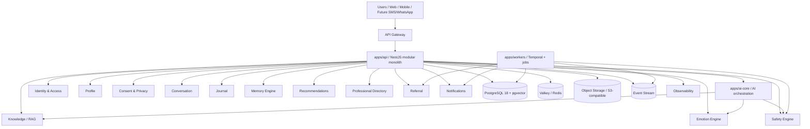

# Sakina Architecture

## Goal

Sakina is not a chatbot. It is a Digital Health platform for emotional wellbeing, mental health support, crisis safety, structured journaling, and guided support pathways.

The backend must be created as a production-grade platform with a clear separation between:

- user identity and account data
- clinical safety and distress logic
- AI orchestration and model gateways
- knowledge retrieval and source provenance
- analytics and product telemetry
- human referrals and professional services

## High-level architecture



## Design principles

1. Security before features.
2. Privacy before analytics.
3. Human remains responsible for healthcare decisions.
4. AI must never diagnose alone.
5. AI must never claim certainty about emotional states.
6. All emotional inferences are probabilistic and confidence-scored.
7. Users may correct AI interpretation.
8. Users may delete their data.
9. Health data never enters standard technical logs.
10. No provider is architecturally mandatory.
11. AI model routing and safety must remain modular.
12. No emotional dependency is intentionally created.
13. The platform complements professionals; it does not replace them.

## Architectural principles

### 1. Modular monolith first

The project will begin as a modular monolith, not a fragmented microservice topology. The codebase should be properly segmented so services can later be split without rewriting the domain model.

### 2. Domain separation

The system is organized by business domains instead of by technical concerns:

- Identity
- Profile
- Consent
- Conversations
- Journal
- Wellness
- Addiction support
- Professional directory
- Referral
- Notifications
- Knowledge
- Analytics
- Admin
- Audit
- Interoperability

### 3. AI as a managed subsystem

AI is a component inside a broader health platform, not the central product by itself.

### 4. Safety-first design

The safety engine sits between the workflow and final response generation.

### 5. Privacy-by-design

Sensitive health data must be isolated from identity and operational telemetry.

## Target stack

### Backend

- TypeScript
- Node.js LTS
- NestJS
- REST + OpenAPI 3.1
- WebSockets for live features when needed
- Prisma (selected) or Drizzle; Prisma is recommended for speed and maturity

### Database

- PostgreSQL 18 with pgvector
- versioned migrations
- transactions and constraints
- indexes and constraints
- Row Level Security when relevant

### Cache / sessions / distributed coordination

- Valkey / Redis compatible

### Messaging

- NATS JetStream or Redpanda

### Workflow orchestration

- Temporal

### Storage

- S3-compatible object storage
- MinIO in development
- signed URLs and lifecycle policies

### Auth

- Keycloak / OIDC
- MFA readiness
- secure session management

### Observability

- OpenTelemetry
- Prometheus
- Grafana
- Loki optional

### Infrastructure

- Docker / Compose
- Kubernetes / Helm / Terraform
- GitHub Actions

## Domain boundaries

### Identity domain

Users, accounts, roles, organizations, devices, sessions, permissions.

### Profile domain

Preferences, accessibility, demographic profile, locale, timezone, communication preferences.

### Consent domain

Terms, privacy, AI usage, voice, research, referral, marketing, revocation, audit.

### Conversation domain

Conversations, messages, attachments, summaries, safety state, participant metadata.

### Journal domain

Mood, emotion tags, notes, time series, trends.

### Wellness domain

Exercises, breathing, sleep support, psychoeducation, routines, self-management actions.

### Addiction support domain

Support patterns for gambling, social media, adult content, substance-related issues, compulsive behaviors.

### Professional directory domain

Professionals, facilities, specialties, referrals, availability, verification, permissions.

### Referral domain

Escalation workflow, human follow-up, consent flows, referral tracking.

### Notification domain

Push, email, SMS abstraction, future WhatsApp/Telegram pipelines.

### Knowledge domain

Trusted health content with source provenance and retrieval.

### Analytics domain

Aggregated and anonymized product insights, without exposing sensitive user information.

## Data isolation strategy

```text
identity schema       -> user IDs, roles, sessions, devices
profile schema        -> language, preferences, timezone, accessibility
mental_health schema  -> journals, emotions, conversations, risk state
ai schema             -> inference metadata, model versioning, embeddings metadata
analytics schema      -> aggregated metrics only
fhir schema           -> FHIR resources, adapters, mapping tables
audit schema          -> append-only security events
```

## AI architecture summary

### Sakina Affect Core

This subsystem must generate affect states using multiple dimensions rather than a single label.

Required dimensions:

- emotion distribution
- valence
- arousal
- dominance
- needs
- conversational state
- uncertainty
- evidence
- modality quality
- temporal trend
- user correction availability

The output is always probabilistic and confidence-aware.

### Safety Core

The safety engine must operate before final generation and must be independent from the generative model.

It handles:

- distress
- crisis indicators
- self-harm concern
- suicidal ideation
- abuse and violence
- severe confusion
- substance crisis
- safeguarding concerns

### Response Policy Engine

The LLM does not choose the output policy alone. Response mode is decided through a structured policy engine.

Possible modes:

- LISTEN
- VALIDATE
- CLARIFY
- GROUND
- EDUCATE
- ENCOURAGE_HELP
- REFER
- CRISIS
- FOLLOW_UP

## Key deliverables

Phase A must produce:

- clear architectural foundation
- ADRs
- security threat model
- privacy model
- data separation plan
- AI safety structure
- technical roadmap

## Roadmap

### Phase 1

- NestJS API bootstrap
- PostgreSQL setup
- Prisma schema foundations
- user and consent domain
- auth foundation
- base modules

### Phase 2

- conversation domain
- message and conversation APIs
- journal and emotion APIs
- memory model

### Phase 3

- AI model gateway
- safety engine
- affect engine
- knowledge/RAG setup

### Phase 4

- professional directory and referral
- notifications and workflows
- Temporal integration

### Phase 5

- observability, security hardening, backups, disaster recovery

## Critical constraints

- No fake “AI diagnosis” claims
- No raw sensitive data in logs
- No emotional dependence strategy
- No single vendor lock-in
- No “chatbot first” architecture
- No direct response generation without safety verification

